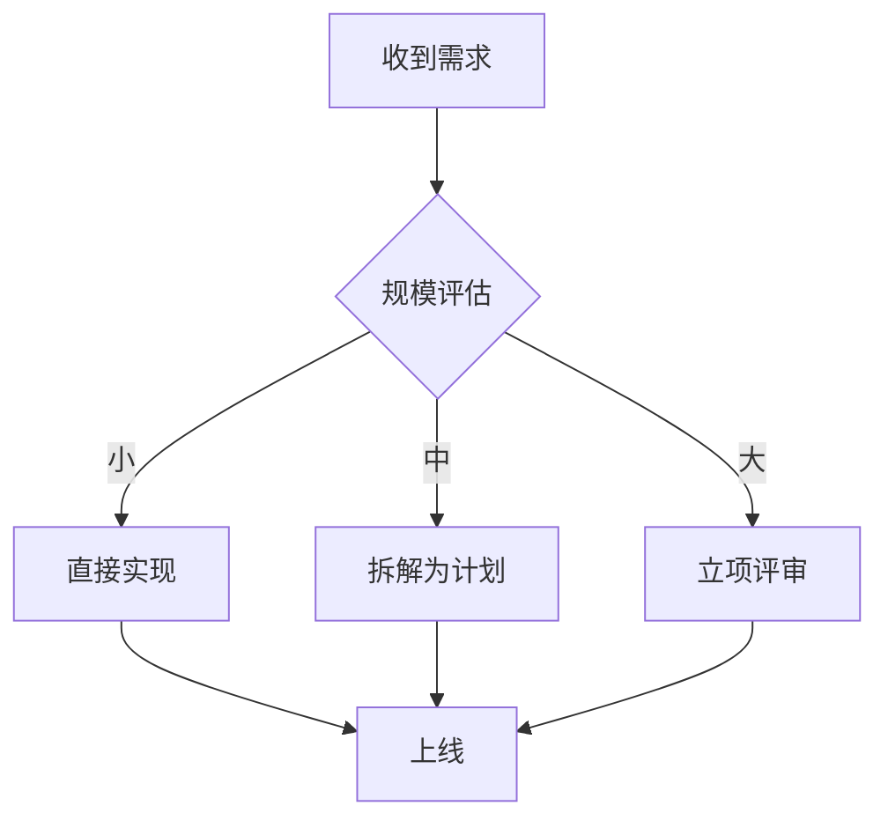
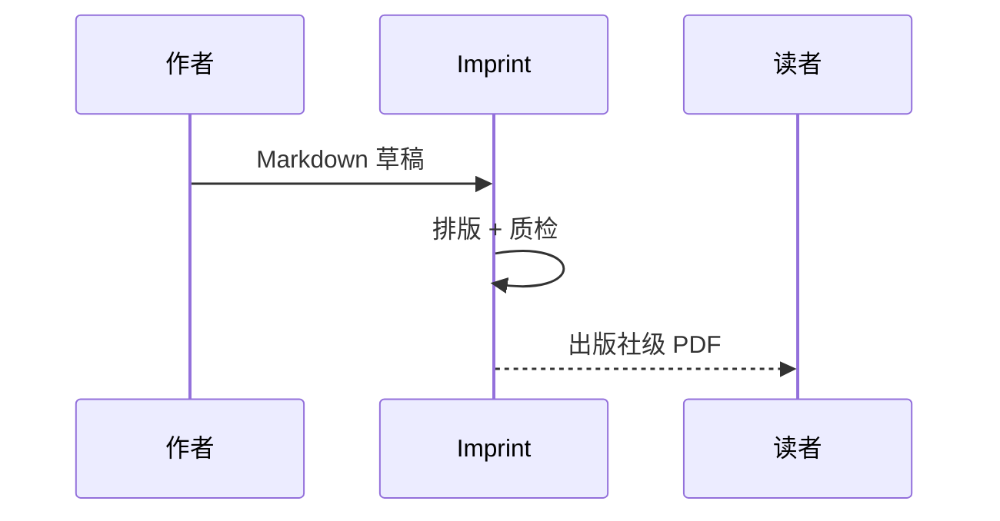

# 在 PDF 里放图表

Imprint 直接把 Mermaid 代码块渲染成矢量图：印刷清晰、可无限缩放、中文正常。装好可选依赖后，` ```mermaid ` 代码块就是一张图。

## 流程图


```mermaid
graph TD
    A[收到需求] --> B{规模评估}
    B -- 小 --> C[直接实现]
    B -- 中 --> D[拆解为计划]
    B -- 大 --> E[立项评审]
    C --> F[上线]
    D --> F
    E --> F
```

## 时序图


```mermaid
sequenceDiagram
    participant 作者
    participant Imprint
    participant 读者
    作者->>Imprint: Markdown 草稿
    Imprint->>Imprint: 排版 + 质检
    Imprint-->>读者: 出版社级 PDF
```

## 说明

图表是矢量格式，放大到任何倍率都不会有锯齿；如果本机没有安装图表引擎，这段代码会退化成普通代码块，不会报错。
