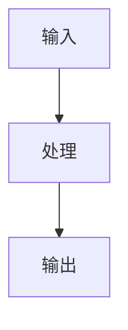

# 概述

一句话说明这是做什么的、给谁看。

# 快速开始

```bash
pip install xxx
xxx --help
```

> [!NOTE]
> 技术文档建议使用 `ocean` 或 `modern` 主题。

# 使用指南

## 基础用法

步骤一、步骤二。

## 进阶

表格、代码示例、图表：



# API 参考

| 方法 | 说明 |
|---|---|
| `run()` | 执行 |

> [!WARNING]
> 标记破坏性变更与迁移注意事项。
